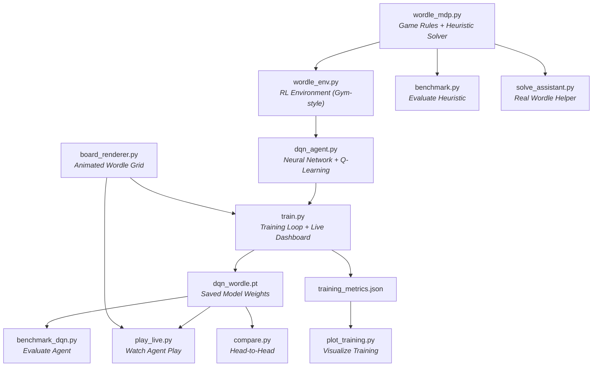
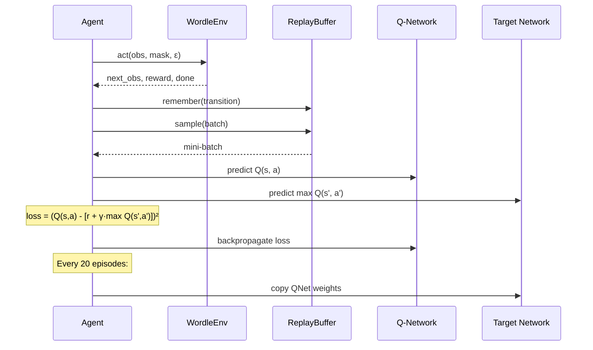

# Wordle Solver — RL Project Deep Dive

## What This Project Does

This project teaches a **neural network to play Wordle** using **Deep Q-Learning (DQN)** — a core reinforcement learning algorithm. It also implements a strong **entropy-greedy heuristic** as a baseline to compare against. You can train the agent, benchmark both strategies, and watch them play live with animated Wordle boards.

---

## The Big Picture



---

## Layer 1: Game Rules — [`wordle_mdp.py`](file:///c:/Users/flexycode/Desktop/RL%20PROJECT/wordle_mdp.py)

This is the **foundation**. It defines Wordle as a **Markov Decision Process (MDP)** — the mathematical framework reinforcement learning operates on.

### Key Functions

| Function | What It Does |
|---|---|
| [`load_word_lists()`](file:///c:/Users/flexycode/Desktop/RL%20PROJECT/wordle_mdp.py#L35-L46) | Loads `wordles.json` (2,309 secret answers) and `nonwordles.json` (8,636 extra valid guesses) |
| [`score_guess(guess, answer)`](file:///c:/Users/flexycode/Desktop/RL%20PROJECT/wordle_mdp.py#L57-L77) | The core Wordle logic — returns a tuple like `(2, 0, 1, 0, 2)` where 2=🟩, 1=🟨, 0=⬜. Correctly handles duplicate letters. |
| [`filter_candidates()`](file:///c:/Users/flexycode/Desktop/RL%20PROJECT/wordle_mdp.py#L89-L90) | Narrows down possible answers based on feedback |
| [`expected_info_gain()`](file:///c:/Users/flexycode/Desktop/RL%20PROJECT/wordle_mdp.py#L97-L111) | Calculates how many **bits of information** a guess reveals (Shannon entropy) |
| [`best_guess()`](file:///c:/Users/flexycode/Desktop/RL%20PROJECT/wordle_mdp.py#L114-L129) | The **entropy heuristic policy** — picks the guess that maximizes information gain |

### The MDP Formulation

```
State   → Set of remaining candidate words
Action  → Which 5-letter word to guess
Reward  → -1 per guess, +10 for solving, -5 for failing (>6 guesses)
```

> [!NOTE]
> The entropy heuristic is a **one-step greedy** policy (not full Bellman-optimal), but it achieves ~100% win rate with an average of 4.19 guesses. This is the baseline the DQN agent tries to match.

---

## Layer 2: RL Environment — [`wordle_env.py`](file:///c:/Users/flexycode/Desktop/RL%20PROJECT/wordle_env.py)

This wraps the game rules into a standard **Gym-style RL environment** that the neural network can interact with.

### The Interface

```python
obs = env.reset()                          # Start a new game
obs, reward, done, info = env.step(action)  # Make a guess
mask = env.valid_action_mask()              # Which words are still possible?
```

### Observation Space (183 dimensions)

The neural network can't understand "a set of candidate words," so the environment converts the game state into a **183-dimensional feature vector**:

| Feature | Dimensions | Encoding |
|---|---|---|
| Green letters (confirmed correct positions) | 5 × 26 = **130** | One-hot: position × letter |
| Yellow letters (present but wrong spot) | **26** | Binary per letter |
| Gray letters (confirmed absent) | **26** | Binary per letter |
| Guesses remaining (normalized 0–1) | **1** | Scalar |

### Action Masking ([`valid_action_mask()`](file:///c:/Users/flexycode/Desktop/RL%20PROJECT/wordle_env.py#L83-L102))

This is **critical for making DQN work** on Wordle. Without it, the agent would waste most of its exploration guessing words that are already known to be impossible. The mask filters out:
- Words with wrong letters in green-confirmed positions
- Words missing yellow-confirmed letters
- Words containing gray-confirmed letters
- Previously guessed words

### Reward Shaping ([`step()`](file:///c:/Users/flexycode/Desktop/RL%20PROJECT/wordle_env.py#L104-L156))

The raw MDP reward (-1 per guess) is too sparse for learning, so **reward shaping** adds:

```python
reward = -1.0                              # Base cost per guess
reward += 0.5 * log2(prev_candidates / new_candidates)  # Information gain bonus
reward += 10.0  # if solved
reward -= 5.0   # if failed (>6 guesses)
```

> [!IMPORTANT]
> The information-gain bonus is what makes learning tractable. It gives the agent a **dense signal** — "this guess was informative" — instead of waiting until the end of the game to find out if it won.

---

## Layer 3: Neural Network — [`dqn_agent.py`](file:///c:/Users/flexycode/Desktop/RL%20PROJECT/dqn_agent.py)

This implements the **Deep Q-Network (DQN)** algorithm.

### Architecture ([`QNetwork`](file:///c:/Users/flexycode/Desktop/RL%20PROJECT/dqn_agent.py#L29-L41))

```
Input (183) → Linear(256) → ReLU → Linear(256) → ReLU → Linear(n_actions)
```

The network takes the 183-dim observation and outputs a **Q-value for every possible word**. The word with the highest Q-value is the agent's best guess.

### Key Components

| Component | Purpose |
|---|---|
| [`QNetwork`](file:///c:/Users/flexycode/Desktop/RL%20PROJECT/dqn_agent.py#L29-L41) | 3-layer MLP that maps observations → Q-values |
| [`ReplayBuffer`](file:///c:/Users/flexycode/Desktop/RL%20PROJECT/dqn_agent.py#L44-L55) | Stores past experiences `(obs, action, reward, next_obs, done)` for training stability |
| [`DQNAgent.act()`](file:///c:/Users/flexycode/Desktop/RL%20PROJECT/dqn_agent.py#L72-L87) | **ε-greedy** action selection over the **masked** action set |
| [`DQNAgent.train_step()`](file:///c:/Users/flexycode/Desktop/RL%20PROJECT/dqn_agent.py#L92-L117) | Samples a batch from replay buffer, computes TD targets, updates Q-network |
| [`target_net`](file:///c:/Users/flexycode/Desktop/RL%20PROJECT/dqn_agent.py#L65-L67) | A frozen copy of the Q-network used for stable target computation |

### How DQN Learning Works



---

## Layer 4: Training — [`train.py`](file:///c:/Users/flexycode/Desktop/RL%20PROJECT/train.py)

The main training loop that ties everything together.

### Training Flow

1. **Initialize**: Create environment with `n_words` words, create DQN agent
2. **For each episode** (1 to 2000):
   - Start a new game with a random secret word
   - Agent plays the game using ε-greedy (starts exploring randomly, gradually shifts to exploiting learned knowledge)
   - Every experience is stored in the replay buffer
   - After every step, sample a batch and train the Q-network
   - Every 20 episodes, sync the target network
   - Every 100 episodes, evaluate win rate and play a live demo game
3. **Save**: `dqn_wordle.pt` (model) + `training_metrics.json` (curves)

### Epsilon Decay

```
ε starts at 1.0 (100% random)  →  decays linearly  →  ε ends at 0.05 (5% random)
                                   over 70% of training
```

### Curriculum Learning & Win Rate Dynamics

To successfully train the agent on the massive 8,636 word dictionary (as opposed to just 200 words), we use **Curriculum Learning** (`--curriculum`). 

- **The Process**: The agent starts training on a tiny subset of 200 words. Once it masters them (or after a set number of episodes), the pool doubles to 400, then 800, up to 8,636.
- **Win Rate Fluctuation**: In the terminal logs, you'll see the win rate (`wr=`) start very high (e.g., 90%+ on 200 words). Every time the curriculum expands (`>> Curriculum: expanded to X words...`), the win rate temporarily **drops** because the state and action spaces just got much harder. As training continues in that stage, the agent adapts, and the win rate climbs back up, finishing strong (e.g., ~80-88% overall on the final 20,000th step).

### Live Dashboard ([`TrainingDashboard`](file:///c:/Users/flexycode/Desktop/RL%20PROJECT/train.py#L62-L118))

A matplotlib window with:
- **Left panel**: Animated Wordle board showing the agent play a demo game at each checkpoint
- **Right panel**: Win rate and average guesses curves updating in real time

---

## Layer 5: Visualization — [`board_renderer.py`](file:///c:/Users/flexycode/Desktop/RL%20PROJECT/board_renderer.py)

A reusable **animated Wordle board** component built with matplotlib. Shared by both `train.py` and `play_live.py`.

- Letters appear one-by-one (typing animation)
- Tiles flip to reveal colors (🟩🟨⬜) with delays
- `speed` parameter controls animation pace
- `reset()` clears the board for reuse without creating a new window

---

## Supporting Scripts

| Script | Purpose |
|---|---|
| [`play_live.py`](file:///c:/Users/flexycode/Desktop/RL%20PROJECT/play_live.py) | Watch either agent play a single animated Wordle game |
| [`benchmark.py`](file:///c:/Users/flexycode/Desktop/RL%20PROJECT/benchmark.py) | Evaluate the entropy heuristic on all 2,309 answers |
| [`benchmark_dqn.py`](file:///c:/Users/flexycode/Desktop/RL%20PROJECT/benchmark_dqn.py) | Evaluate the trained DQN on its word pool |
| [`compare.py`](file:///c:/Users/flexycode/Desktop/RL%20PROJECT/compare.py) | Run both agents on the same words, print side-by-side stats |
| [`plot_training.py`](file:///c:/Users/flexycode/Desktop/RL%20PROJECT/plot_training.py) | Generate publication-quality training curves from `training_metrics.json` |
| [`solve_assistant.py`](file:///c:/Users/flexycode/Desktop/RL%20PROJECT/solve_assistant.py) | Interactive tool — suggests guesses while you play real NYT Wordle |
| [`find_opener.py`](file:///c:/Users/flexycode/Desktop/RL%20PROJECT/find_opener.py) | Brute-force finds the optimal opening word (RAISE, 5.88 bits) |
| [`efficompa.py`](file:///c:/Users/flexycode/Desktop/RL%20PROJECT/efficompa.py) | Simple model comparison plots |

---

## Data Files

| File | Contents |
|---|---|
| [`wordles.json`](file:///c:/Users/flexycode/Desktop/RL%20PROJECT/wordles.json) | 2,309 possible secret answers (the real NYT Wordle list) |
| [`nonwordles.json`](file:///c:/Users/flexycode/Desktop/RL%20PROJECT/nonwordles.json) | 8,636 additional valid guesses (accepted but never secret) |
| [`best_opener.json`](file:///c:/Users/flexycode/Desktop/RL%20PROJECT/best_opener.json) | Cached optimal first guess: "RAISE" |
| [`training_metrics.json`](file:///c:/Users/flexycode/Desktop/RL%20PROJECT/training_metrics.json) | Checkpoint data from the last training run |
| `dqn_wordle.pt` / `v2` / `v3` | Pre-trained PyTorch model checkpoints (different training runs) |

---

## Key RL Concepts Used

| Concept | Where It Appears |
|---|---|
| **MDP** (Markov Decision Process) | `wordle_mdp.py` — the whole game formulation |
| **Q-Learning** | `dqn_agent.py` — learning action values from experience |
| **Function Approximation** | `QNetwork` — using a neural net instead of a table |
| **Experience Replay** | `ReplayBuffer` — breaking temporal correlations in training data |
| **Target Network** | `target_net` — stabilizing Q-learning updates |
| **ε-Greedy Exploration** | `act()` — balancing exploration vs exploitation |
| **Action Masking** | `valid_action_mask()` — constraining the action space |
| **Reward Shaping** | `step()` — adding information-gain bonus for dense feedback |
| **Information Theory** | `expected_info_gain()` — entropy as a heuristic policy |
