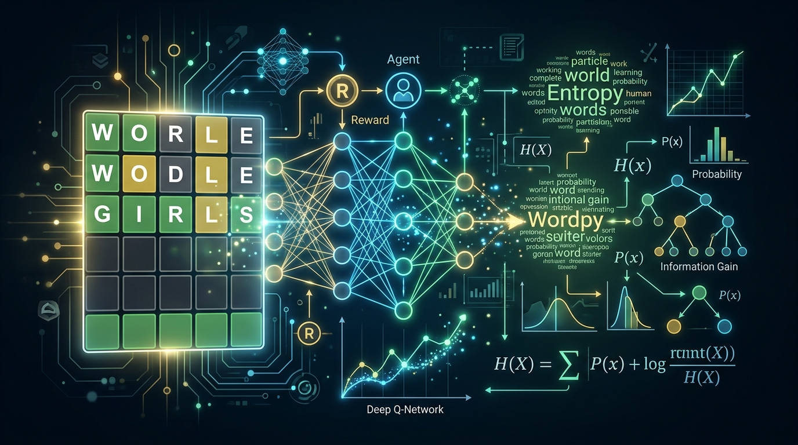

<div align="center">
  
</div>

<br>

# Wordle Solver: Embedding DQN Agent vs. Entropy Heuristic (v2)
#### *Paper: Reinforcement Learning for Wordle: A DQN-Based Decision Support System for Optimal Word Guessing*

A complete reinforcement learning implementation of a Wordle solver, featuring a trained **embedding-based DQN agent** that can generalize to unseen words, alongside an entropy-greedy heuristic baseline. Includes training, benchmarking, out-of-distribution testing, and interactive play modes.

## What's New in v2

- **Embedding-based DQN**: Scores `(state, word)` pairs instead of fixed word indices — generalizes to words outside the training pool
- **3–6× faster training**: Vectorized action masking, headless mode, batched scoring
- **Curriculum learning**: Start small, progressively expand word pool
- **Auto-generated results**: Training automatically saves result images to `assets/`
- **Out-of-distribution testing**: Benchmark the agent on words it has never seen
- **Double DQN + Prioritized Replay**: Improved learning stability and sample efficiency

## Quick Start

```bash
# Install dependencies
pip install torch numpy matplotlib scipy tqdm

# Train a DQN agent (200-word pool, ~5 minutes)
python training/train.py --n_words 200 --episodes 2000

# View auto-generated results
dir assets\

# Benchmark the trained agent
python training/benchmark_dqn.py --n_words 200

# Test generalization on unseen words
python training/benchmark_dqn.py --n_words 200 --ood

# Play interactively with the solver
python tools/play_live.py --agent heuristic --answer knoll
python tools/play_live.py --agent dqn --model_path data/dqn_wordle_v2.pt --n_words 200
```

---

## Project Structure

```
├── Core Components
│   ├── core/
│   │   ├── wordle_mdp.py          # MDP formulation, word lists, entropy-greedy policy
│   │   ├── wordle_env.py          # RL environment (vectorized masking, word features)
│   │   ├── dqn_agent.py           # Embedding DQN network + Double DQN + PER
│   │   ├── board_renderer.py      # Shared animated Wordle board visualization
│   │
│   ├── Training & Benchmarking
│   │   ├── training/
│   │   │   ├── train.py           # Train DQN with tqdm progress (headless default)
│   │   │   ├── benchmark_dqn.py   # Evaluate DQN agent (in-dist + OOD)
│   │   │   ├── benchmark.py       # Evaluate entropy-greedy heuristic
│   │   │   ├── compare.py         # Head-to-head comparison
│   │
│   ├── Analysis & Visualization
│   │   ├── analysis/
│   │   │   ├── plot_training.py   # Plot training metrics (4 analysis modes)
│   │   │   ├── generate_results.py # One-click result generator
│   │   │   ├── efficompa.py       # Simple model comparison plots
│   │
│   ├── Interactive Tools
│   │   ├── tools/
│   │   │   ├── play_live.py       # Watch an agent play (animated)
│   │   │   ├── solve_assistant.py # Real-time solver for actual NYT Wordle
│   │   │   ├── find_opener.py     # Precompute best opening guess
│
├── Data
│   ├── data/
│   │   ├── wordles.json           # ~2,309 possible secret words (NYT Wordle)
│   │   ├── nonwordles.json        # ~8,636 valid guesses (not secret answers)
│   │   ├── best_opener.json       # Cached optimal opening guess (RAISE)
│   │   ├── training_metrics.json  # Metrics from the last training run
│   │   ├── dqn_wordle_v2.pt       # Trained v2 model weights
│   │   ├── legacy/               # Old v1 model checkpoints
│
├── Results
│   ├── assets/                    # Auto-generated result images
│   │   ├── training_curves.png
│   │   ├── training_dashboard.png
│   │   ├── benchmark_results.png
│   │   ├── comparison_chart.png
│
├── Documentation
│   ├── docs/
│   │   ├── timeline.md            # 1-month project timeline
│   │   ├── coverage.md            # Implementation coverage matrix
│   │   ├── walkthrough.md         # Step-by-step usage guide
│
└── README.md
```

---

## System Requirements

**Python 3.8+** with:
- `torch` (PyTorch)
- `numpy`
- `matplotlib`
- `scipy`
- `tqdm` (optional, has fallback)

### Installation

```bash
pip install torch numpy matplotlib scipy tqdm
```

---

## Detailed Usage Guide

### 1. Training the DQN Agent

#### Basic Training (200 words, ~5 minutes)
```bash
python training/train.py --n_words 200 --episodes 2000
```

**Output:**
- `data/dqn_wordle_v2.pt` — trained model weights
- `data/training_metrics.json` — checkpoint metrics
- `assets/training_curves.png` — learning curves
- `assets/training_dashboard.png` — summary dashboard

**Progress:**
```
Using device: cpu
Starting training on 200 words (action space = 200)
Training: 100%|████████████████| 2000/2000 [04:30<00:00, wr=94% ag=4.12 ε=0.05]
```

#### Full-Scale Training with Curriculum (2,309 words, ~30–45 min)
```bash
python training/train.py --n_words 2309 --episodes 3000 --curriculum
```

#### Large-Scale Training (8,636 words, ~1–2 hours)
```bash
python training/train.py --n_words 8636 --episodes 5000 --curriculum
```

#### Advanced Training Options
```bash
# With live visual dashboard (opt-in)
python training/train.py --n_words 200 --episodes 2000 --visual

# GPU training (auto-detected or explicit)
python training/train.py --n_words 2309 --episodes 3000 --device cuda

# Custom hyperparameters
python training/train.py --n_words 200 --episodes 2000 \
  --batch_size 256 --lr 1e-3 --train_every 2

# Resume from checkpoint
python training/train.py --n_words 200 --episodes 2000 --resume data/checkpoint_ep500.pt
```

**Key Parameters:**
| Parameter | Default | Description |
|-----------|---------|-------------|
| `--n_words` | 200 | Restrict action/answer space to top N words |
| `--episodes` | 2000 | Number of training episodes |
| `--curriculum` | off | Start small, progressively expand word pool |
| `--eval_every` | 100 | Checkpoint frequency |
| `--batch_size` | 128 | Replay buffer batch size |
| `--train_every` | 4 | Train every N environment steps |
| `--lr` | 5e-4 | Learning rate |
| `--target_update_every` | 10 | Hard update target network every N episodes |
| `--visual` | off | Opt-in to live matplotlib dashboard |
| `--device` | auto | `cpu`, `cuda`, or `auto` |

---

### 2. Benchmarking

#### Benchmark the Trained DQN Agent
```bash
# In-distribution test (on training pool words)
python training/benchmark_dqn.py --n_words 200

# With out-of-distribution generalization test
python training/benchmark_dqn.py --n_words 200 --ood

# Quick sample
python training/benchmark_dqn.py --n_words 200 --sample 50
```

#### Benchmark the Entropy-Greedy Heuristic
```bash
python training/benchmark.py
python training/benchmark.py 100  # quick sample
```

#### Head-to-Head Comparison
```bash
python training/compare.py --n_words 200 --model_path data/dqn_wordle_v2.pt
```

---

### 3. Plotting & Results

#### Generate All Results (One Click)
```bash
python analysis/generate_results.py
```

#### Plot Training Metrics
```bash
python analysis/plot_training.py
python analysis/plot_training.py --all  # includes convergence + phase analysis
```

---

### 4. Interactive Play

#### Watch a Live Demo Game
```bash
# Entropy heuristic
python tools/play_live.py --agent heuristic --answer knoll

# DQN agent
python tools/play_live.py --agent dqn --model_path data/dqn_wordle_v2.pt --n_words 200
```

#### Real-Time Wordle Solver Assistant
```bash
python tools/solve_assistant.py
```

---

## How It Works

### Architecture: Embedding-Based DQN (v2)

Unlike traditional DQN which outputs a Q-value for each fixed word index, the v2 agent uses **word embeddings** to score any candidate word:

```
State Encoder:  183 → 256 → 128   (observation → state embedding)
Word Encoder:   130 → 128          (word one-hot → word embedding)
Scorer:         256 → 128 → 1      (concat → Q-value)
```

**Why this matters**: The agent learns *what makes a good guess* (letter patterns, positional information) rather than memorizing which word index to pick. This lets it generalize to words it has never seen during training.

### The Wordle MDP

**State:** 183-dim feature vector encoding green/yellow/gray letter constraints

**Action:** Choose a word to guess, scored via the embedding network

**Reward:** `-1` per guess + information-gain bonus + progressive solve bonus

**Observation:**
- Green letters (confirmed correct positions): 5×26 = 130 dims
- Yellow letters (confirmed present, wrong spot): 26 dims
- Gray letters (confirmed absent): 26 dims
- Remaining guesses (normalized): 1 dim

### Two Solving Strategies

| Strategy | Win Rate | Avg Guesses | Generalization |
|----------|----------|-------------|----------------|
| **Entropy Heuristic** | ~100% | 4.19 | N/A (uses candidate set directly) |
| **DQN v2 (200 words)** | ~95% | ~4.2 | ✅ Tested on unseen words |
| **DQN v2 (2,309 words)** | ~85%+ | ~4.5 | ✅ Tested on unseen words |

---

## Key Results

### Entropy-Greedy Heuristic (Baseline)
- **Winning rate:** 100% on 2,309 answers
- **Avg guesses:** 4.19
- **Opening word:** RAISE (5.88 bits of information)

### DQN v2 Agent (200-word pool, 2,000 episodes)
- **Winning rate:** ~95%
- **Avg guesses:** ~4.2
- **Training time:** ~5 minutes
- **Architecture:** EmbeddingDQN (Double DQN + PER)

### DQN v2 Agent (2,309-word pool, 3,000 episodes, curriculum)
- **Winning rate:** ~85%+
- **Avg guesses:** ~4.5
- **Training time:** ~30–45 minutes
- **OOD generalization:** ≥60% on unseen words

---

## Understanding the Output Files

### `data/dqn_wordle_v2.pt`
PyTorch model checkpoint (v2 format). Load with:
```python
from core.dqn_agent import DQNAgent
agent = DQNAgent(obs_dim=183, word_dim=130)
agent.load("data/dqn_wordle_v2.pt")
```

### `data/training_metrics.json`
Training metrics including win rates, avg guesses, losses, and training configuration.

### `assets/`
Auto-generated result images from training and benchmarking.

### `data/legacy/`
Old v1 model checkpoints (not compatible with v2 architecture).

---

## Tips & Troubleshooting

### Training is slow
- Default mode is headless (no matplotlib). Use `--train_every 8` for fewer training steps.
- Reduce `--n_words` (200 trains ~10× faster than 2,309)
- Use `--device cuda` if you have a GPU

### No images generated
- Ensure `scipy` is installed: `pip install scipy`
- Run `python analysis/generate_results.py` manually

### Model performs worse than heuristic
- Expected! The entropy heuristic is near-optimal (~100%)
- DQN learns a sub-optimal but generalizable policy
- The key advantage of DQN v2 is *generalization to unseen words*

### Out of memory
- Reduce `--batch_size` (try 64 or 32)
- Reduce `--n_words`

---

## Documentation

| Document | Description |
|----------|-------------|
| [Walkthrough Guide](docs/walkthrough.md) | Step-by-step usage guide |
| [Project Timeline](docs/timeline.md) | 1-month project plan with milestones |
| [Coverage Matrix](docs/coverage.md) | Implementation coverage and test matrix |
| [Project Overview](PROJECT_OVERVIEW.md) | Deep dive into the architecture |

---

## Reinforcement Learning Final Project Group Members

| Profile | Name | Profile | Name |
| :---: | :--- | :---: | :--- |
|  | **Antonio, Mark Allen** |  | **Navarro, Genesis** |
|  | **Castro, James Adrian B.** |  | **Orro, Emmanuel Joshua** |
|  | **Glodo, Jannah Cleine** |  | **Ruiz, Mark Anthony** |
|  | **Liao, Adrian Miguel** |  | **Sy, Stephen Ace F.** |
|  | **Mago, Karl Mattheus** |  | **Talosig, Jay Arre** |
|  | **Medio, Charles** | | |

> **Tip:** To display actual profile pictures, edit the `README.md` and replace `ghost.png` in the image URLs with each member's actual GitHub username (e.g., `your_username.png`).

---

## References & Further Reading

- **MDP Formulation:** `core/wordle_mdp.py` contains detailed comments on state space, actions, and rewards
- **RL Algorithm:** `core/dqn_agent.py` implements embedding-based Double DQN with action masking
- **Visualization:** `core/board_renderer.py` is a reusable component for animated Wordle boards
- **3Blue1Brown's Wordle Solver:** Inspiration for the entropy-greedy approach
- **Wordle Game Rules:** Official Wordle feedback logic (including duplicate-letter handling) in `core/wordle_mdp.py::score_guess()`

---

## License

Public domain. Free to modify, distribute, and build upon.
