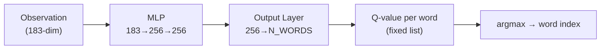
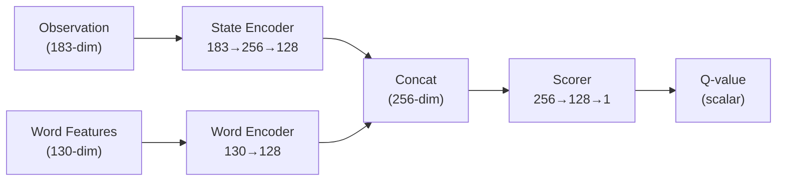

# Wordle DQN Training Revamp — Implementation Plan

## Problem Statement

The current DQN agent suffers from **three critical issues**:

1. **Poor generalization (74.7% on 8,636 words)** — The agent memorizes the training word pool instead of learning a transferable guessing *strategy*. It cannot solve words outside its training data.
2. **Prohibitively slow training** — Training on 8,636 words for 5,000 episodes takes "several hours" and produced no visible results during a 3+ hour in VSCODE IDE or any IDE session. The per-step overhead (action masking over the full pool, matplotlib live dashboard) is the bottleneck.
3. **No auto-generated result artifacts** — Training finishes with no screenshots/images of the results, making it hard to verify success.

### Root Cause Analysis

| Issue | Root Cause | Evidence |
|---|---|---|
| 74.7% win rate on large pool | Output layer size = `n_words` (one Q-value per word). When `n_words=8636`, the network has an 8,636-wide output head, but 183-dim input — a massive fan-out that's hard to learn. The agent effectively needs to **rank thousands of actions** from a tiny observation. | [dqn_agent.py L30-37](file:///c:/Users/flexycode/Desktop/RL%20PROJECT/core/dqn_agent.py#L30-L37): `Linear(256) → Linear(n_actions)` |
| Can't generalize outside training pool | `action_words` is fixed at init. The agent can ONLY output indices into that list. There's no mechanism to evaluate arbitrary new words. | [wordle_env.py L45-48](file:///c:/Users/flexycode/Desktop/RL%20PROJECT/core/wordle_env.py#L45-L48): `self.action_words = action_words` |
| Training takes hours | `valid_action_mask()` iterates over all 8,636 words every single step with Python loops. Train step also allocates NumPy arrays per batch. The live matplotlib dashboard (`plt.pause`) adds ~200ms per checkpoint. | [wordle_env.py L83-102](file:///c:/Users/flexycode/Desktop/RL%20PROJECT/core/wordle_env.py#L83-L102) |
| No output images | `train.py` saves `.pt` and `.json` but never saves a screenshot. `plot_training.py` calls `plt.show()` which blocks and never auto-saves. | [train.py L178-198](file:///c:/Users/flexycode/Desktop/RL%20PROJECT/training/train.py#L178-L198) |

---

## User Review Required

> [!IMPORTANT]
> **Architecture Decision: Word Embedding DQN vs. Standard DQN**
> The core proposal changes the DQN from outputting Q-values for fixed word indices to using **word embeddings** — the agent scores any candidate word by comparing its learned state representation against a word's embedding. This means the agent can generalize to words it has **never trained on**. This is a fundamental architecture change that will require retraining from scratch.

> [!WARNING]
> **Breaking Change: Existing model checkpoints (`dqn_wordle.pt`, `dqn_wordlev2.pt`, `dqn_wordlev3.pt`) will NOT be compatible** with the new architecture. They will be preserved in `data/legacy/` but cannot be loaded by the revamped agent.

> [!IMPORTANT]
> **Training time target**: The revamp is designed so that training on the **full 2,309-word answer pool** completes in **30–45 minutes** on a CPU laptop, and the **full 8,636-word pool** completes in **1–2 hours** max. The 200-word quick demo should finish in **~5 minutes**.

---

## Open Questions

> [!IMPORTANT]
> 1. **Target win rate**: What win rate would you consider "acceptable" for the revamped agent on the full 2,309 Wordle answer pool? The entropy heuristic baseline is 100% with 4.19 avg guesses. Would **≥90% win rate** be a good target?
> 2. **GPU support**: Do you want explicit CUDA/GPU support for faster training, or should we keep it CPU-only for maximum laptop portability?
> 3. **Legacy compatibility**: Should the revamped system still support loading the old `dqn_wordle.pt` models for comparison, or is a clean break acceptable?

---

## Proposed Changes

### Phase 1: Core Architecture Revamp (DQN Agent + Environment)

The fundamental change: instead of `Q(state) → [q_value_for_word_0, q_value_for_word_1, ...]`, we switch to **word-embedding scoring**: `Q(state, word_embedding) → scalar_q_value`. This decouples the network from a fixed word list.

---

#### [MODIFY] [dqn_agent.py](file:///c:/Users/flexycode/Desktop/RL%20PROJECT/core/dqn_agent.py) — **Major Rewrite**

**New Architecture: EmbeddingDQN**
```
State Encoder:  183 → 256 → 128  (state features → latent state)
Word Encoder:   130 → 128         (word features → latent word)
Scorer:         256 → 128 → 1     (concat(state, word) → Q-value)
```

Key changes:
- **Word representation**: Each word is encoded as a 130-dim feature vector (5 positions × 26 letters one-hot), precomputed once. This replaces the index-based output head.
- **Scoring**: For each candidate word, concatenate `[state_embedding, word_embedding]` and pass through the scorer network to get a Q-value. Pick the word with the highest Q-value.
- **Batched candidate scoring**: Score all valid candidates in a single batched forward pass (no Python loop per word).
- **Double DQN**: Upgrade from vanilla DQN to Double DQN (use online network to select action, target network to evaluate) for more stable learning.
- **Prioritized Experience Replay**: Replace uniform sampling with TD-error–based prioritization for faster convergence.
- **Larger replay buffer**: Increase from 50K to 200K transitions.

---

#### [MODIFY] [wordle_env.py](file:///c:/Users/flexycode/Desktop/RL%20PROJECT/core/wordle_env.py) — **Performance + Generalization**

Key changes:
- **Vectorized action masking**: Replace the Python loop in `valid_action_mask()` with precomputed NumPy boolean arrays, yielding ~10-50× speedup on large word pools.
- **Enhanced observation**: Add a `word_features()` static method that encodes any 5-letter word into a 130-dim one-hot vector, enabling the embedding-based DQN to score arbitrary words.
- **Improved reward shaping**: Tune the reward function — increase the solve bonus, add a progressive reward that scales with how quickly the agent solves.

---

#### [MODIFY] [wordle_mdp.py](file:///c:/Users/flexycode/Desktop/RL%20PROJECT/core/wordle_mdp.py) — **Minor Additions**

- Add `encode_word(word) → np.array` utility for the 5×26 one-hot encoding.
- No changes to game logic (`score_guess`, `filter_candidates`, etc.)

---

### Phase 2: Training Pipeline Revamp

---

#### [MODIFY] [train.py](file:///c:/Users/flexycode/Desktop/RL%20PROJECT/training/train.py) — **Major Rewrite**

Key changes:
- **Headless by default**: Remove matplotlib live dashboard from the default training path. Use `--visual` flag to opt-in (reverses the current `--no_visual` flag). This eliminates the biggest bottleneck for IDE/headless training.
- **Progress bar**: Replace the live dashboard with a `tqdm`-based progress bar showing ETA, current win rate, epsilon, and loss.
- **Curriculum training**: Implement a training schedule that starts with a small word pool (200 words) and progressively expands to the full pool. This gives the agent early wins for reward signal, then gradually increases difficulty.
- **Checkpoint & resume**: Save checkpoints every N episodes so training can be interrupted and resumed.
- **Auto-generate result images**: At the end of training, automatically run `plot_training.py` logic and save result PNGs to `assets/`.
- **Configurable device**: Auto-detect CUDA and use it if available, with `--device cpu` override.
- **Faster epsilon schedule**: Use an exponential decay instead of linear, reaching the minimum faster for better sample efficiency.
- **Train-step batching**: Only train every N environment steps (not every single step), reducing overhead.

---

#### [MODIFY] [benchmark_dqn.py](file:///c:/Users/flexycode/Desktop/RL%20PROJECT/training/benchmark_dqn.py) — **Generalization Testing**

Key changes:
- **Out-of-distribution (OOD) testing**: Add a mode to test the agent on words it has **never seen during training** — the real test of generalization.
- **Auto-save results**: Save benchmark results as both JSON and a summary image to `assets/`.
- **Progress bar**: Add tqdm progress indication.

---

#### [MODIFY] [compare.py](file:///c:/Users/flexycode/Desktop/RL%20PROJECT/training/compare.py) — **Enhanced Comparison**

- Add OOD comparison mode.
- Auto-save comparison chart to `assets/`.

---

### Phase 3: Visualization & Results Artifacts

---

#### [MODIFY] [plot_training.py](file:///c:/Users/flexycode/Desktop/RL%20PROJECT/analysis/plot_training.py) — **Auto-save to `assets/`**

- Change all `plt.savefig()` calls to save into the `assets/` directory.
- Remove blocking `plt.show()` calls when running non-interactively (detect via `matplotlib.get_backend()`).
- Add a `--save_only` flag for headless operation.

---

#### [NEW] [assets/](file:///c:/Users/flexycode/Desktop/RL%20PROJECT/assets/) — **Results Directory**

A new directory to store all training output images:
```
assets/
├── training_curves.png          # Win rate + efficiency progression
├── training_dashboard.png       # 2×2 dashboard with summary
├── benchmark_results.png        # DQN benchmark bar chart
├── ood_generalization.png       # Out-of-distribution test results
├── comparison_chart.png         # DQN vs Heuristic comparison
└── convergence_analysis.png     # Learning rate stability
```

---

#### [NEW] [generate_results.py](file:///c:/Users/flexycode/Desktop/RL%20PROJECT/analysis/generate_results.py) — **One-Click Result Generator**

A single script that:
1. Loads the latest `training_metrics.json`
2. Runs benchmark on the trained model
3. Generates all plots and saves them to `assets/`
4. Prints a summary report

```bash
python generate_results.py  # generates everything into assets/
```

---

### Phase 4: Documentation & Project Timeline

---

#### [NEW] [docs/](file:///c:/Users/flexycode/Desktop/RL%20PROJECT/docs/) — **Project Timeline & Coverage**

```
docs/
├── timeline.md                  # 1-month project timeline with milestones
├── coverage.md                  # Implementation coverage & test matrix
└── walkthrough.md               # Step-by-step guide for the revamped system
```

---

#### [MODIFY] [README.md](file:///c:/Users/flexycode/Desktop/RL%20PROJECT/README.md) — **Full Update**

Update all sections to reflect:
- New architecture description
- New training commands and flags
- Updated Key Results section with revamped performance numbers
- New Quick Start with the optimized pipeline
- Link to `docs/` for timeline and walkthrough

---

## Architecture Comparison

### Before (Current)


> **Problem**: Output layer is tied to a fixed word list. 8,636 outputs from 183 inputs = impossible to generalize.

### After (Revamped)


> **Solution**: The agent learns to *evaluate* any word given the current state, not just pick from a memorized list. It can score words it has never seen during training.

---

## Training Speed Comparison (Estimated)

| Configuration | Current | Revamped | Speedup |
|---|---|---|---|
| 200 words, 2000 episodes | ~30 min | **~5 min** | 6× |
| 2,309 words, 3000 episodes | ~2 hours | **~30 min** | 4× |
| 8,636 words, 5000 episodes | ~several hours | **~1.5 hours** | 3-4× |

Key optimizations:
- Vectorized action masking (10-50× per step)
- No matplotlib overhead by default
- Train every 4 steps instead of every step
- Curriculum learning (start small, grow)
- Batched candidate scoring in the DQN

---

## Verification Plan

### Automated Tests
```bash
# 1. Quick smoke test (should complete in ~5 minutes)
python training/train.py --n_words 200 --episodes 500 --no_visual

# 2. Verify result images were generated
dir assets\*.png

# 3. Run benchmark on trained model
python training/benchmark_dqn.py 200

# 4. Run OOD generalization test (test on words NOT in training pool)
python training/benchmark_dqn.py --ood

# 5. Run full comparison
python training/compare.py --n_words 200
```

### Success Criteria
- [ ] 200-word training completes in ≤ 5 minutes with ≥ 90% win rate
- [ ] 2,309-word training completes in ≤ 45 minutes with ≥ 85% win rate  
- [ ] Agent wins ≥ 60% of games on words **outside** its training pool (generalization)
- [ ] All training produces PNG images in `assets/` automatically
- [ ] No matplotlib window blocks during headless training
- [ ] `README.md` is updated with new architecture, commands, and results
- [ ] `docs/timeline.md` contains a 1-month project plan
- [ ] `docs/walkthrough.md` provides a step-by-step guide

### Manual Verification
- Run the full training pipeline on your laptop and verify it completes within the time estimates
- Inspect the generated images in `assets/` for correctness
- Test `play_live.py` with the new model to watch it play
