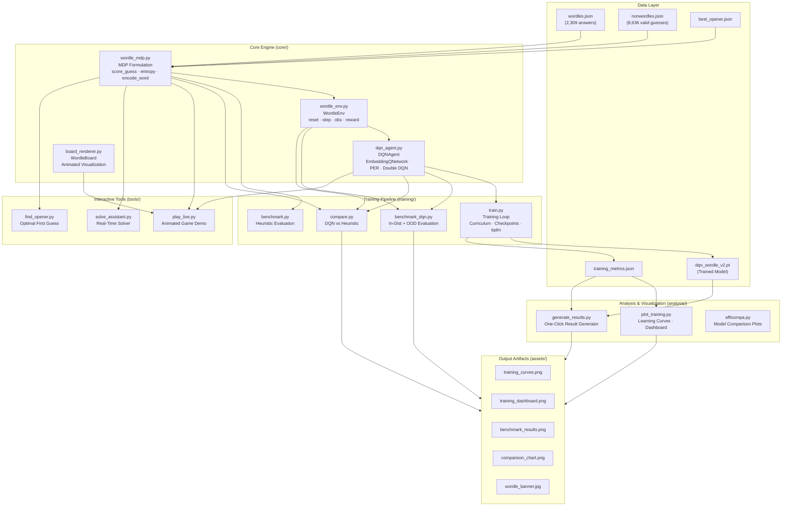
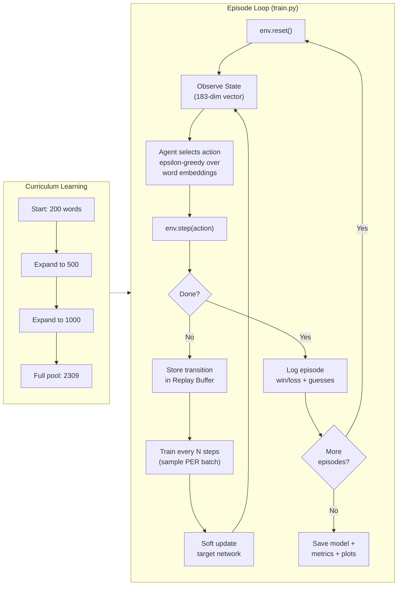
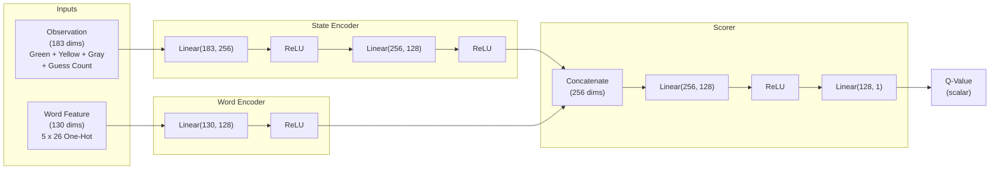
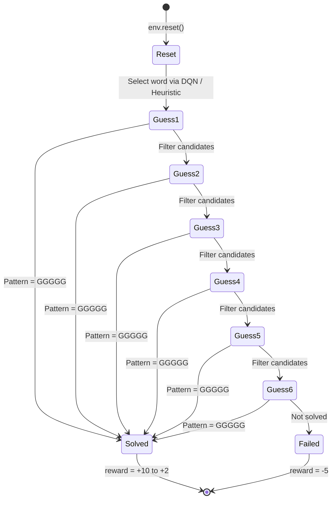
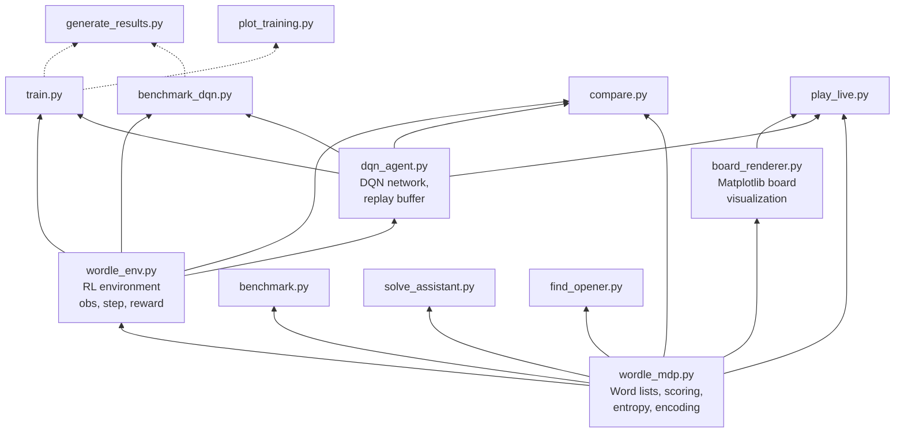
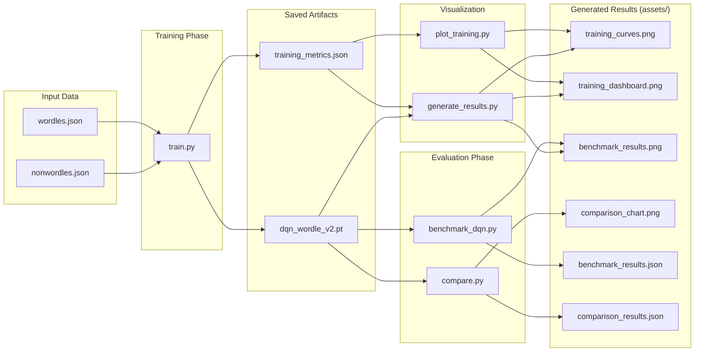
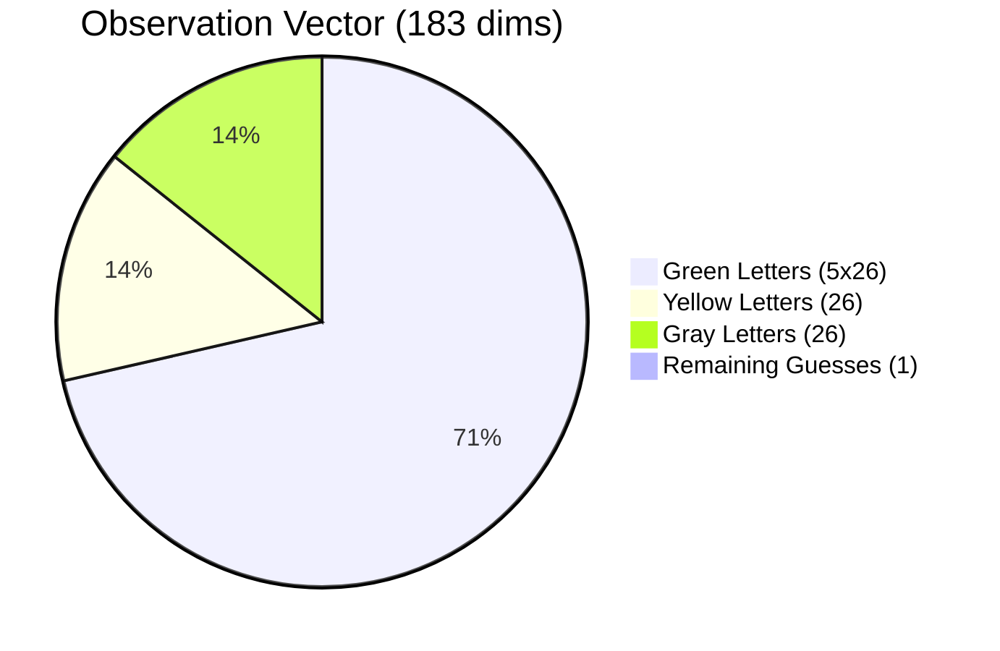
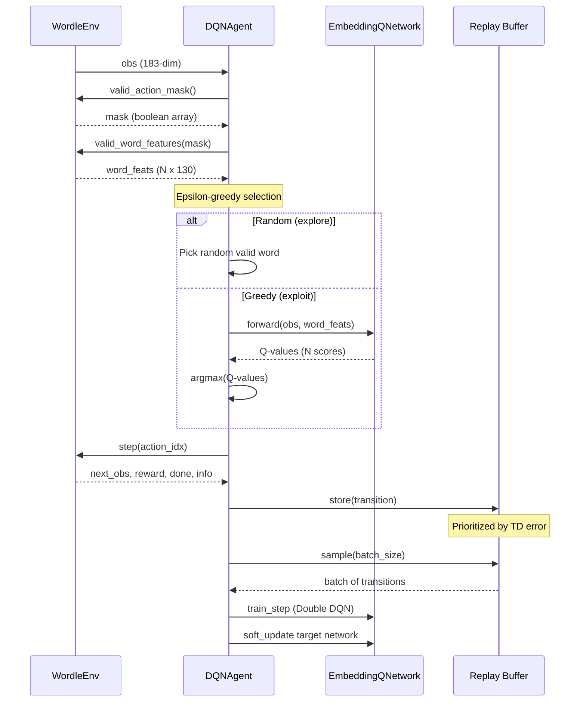

# System Architecture

> **Reinforcement Learning for Wordle: A DQN-Based Decision Support System for Optimal Word Guessing**

This document describes the full system architecture of the Wordle DQN Solver, covering the RL training loop, neural network design, data flow, and module interactions.

---

## Table of Contents

1. [High-Level System Architecture](#high-level-system-architecture)
2. [Reinforcement Learning Training Loop](#reinforcement-learning-training-loop)
3. [Neural Network Architecture](#neural-network-architecture-embeddingqnetwork)
4. [Wordle Environment State Machine](#wordle-environment-state-machine)
5. [Module Dependency Graph](#module-dependency-graph)
6. [Data Flow: Training to Results](#data-flow-training-to-results)
7. [Observation Space Breakdown](#observation-space-breakdown-183-dimensions)
8. [Agent Decision Pipeline](#agent-decision-pipeline)
9. [Glossary of Terms](#glossary-of-terms)

---

## High-Level System Architecture

The system is organized into five logical layers. The **Data Layer** stores word lists and trained model weights. The **Core Engine** implements the Wordle game rules (MDP formulation), the RL environment interface, the DQN neural network agent, and the board visualization. The **Training Pipeline** orchestrates the learning process—running episodes, benchmarking against baselines, and comparing strategies. The **Analysis** layer generates plots and aggregated results. Finally, the **Interactive Tools** let users play live demos or use the solver in real time.

**Layer descriptions:**

| Layer | Purpose | Key Files |
|-------|---------|-----------|
| **Data Layer** | Stores word lists (JSON), cached computations, trained model weights (`.pt`), and training metrics. | `wordles.json`, `nonwordles.json`, `dqn_wordle_v2.pt` |
| **Core Engine** | Implements the Wordle game logic, RL environment interface, neural network architecture, and board visualization. This is the foundation everything else depends on. | `wordle_mdp.py`, `wordle_env.py`, `dqn_agent.py`, `board_renderer.py` |
| **Training Pipeline** | Orchestrates the RL training loop, evaluates the trained agent (in-distribution and out-of-distribution), and compares it against the entropy heuristic. | `train.py`, `benchmark_dqn.py`, `compare.py` |
| **Analysis** | Post-training visualization and result generation. Produces learning curves, dashboards, and summary statistics. | `plot_training.py`, `generate_results.py` |
| **Interactive Tools** | User-facing tools for watching the agent play live, getting real-time solving assistance, or finding the optimal opening word. | `play_live.py`, `solve_assistant.py`, `find_opener.py` |

---

## Reinforcement Learning Training Loop

Training follows the standard RL episodic loop. Each **episode** is one complete Wordle game: the environment picks a secret word, the agent makes up to 6 guesses, and receives rewards based on how quickly it solves (or fails). The agent stores every transition in a **Prioritized Experience Replay (PER)** buffer and periodically samples mini-batches to update its network weights. **Curriculum learning** optionally starts the agent on a small word pool (200 words) and progressively expands it as the win rate improves—this avoids overwhelming the agent with 2,309+ words from the start.

**Key concepts in the training loop:**

| Concept | Description |
|---------|-------------|
| **Episode** | One complete Wordle game from `env.reset()` to terminal state (solved or 6 guesses exhausted). |
| **Epsilon-greedy** | Exploration strategy: with probability epsilon, pick a random word; otherwise, pick the word with the highest Q-value. Epsilon decays exponentially over training. |
| **Train every N steps** | Instead of updating the network after every single environment step, we update every N steps (default 4) to reduce computational overhead and improve stability. |
| **Soft target update** | The target network's weights are slowly blended toward the online network's weights using Polyak averaging: `target = tau * online + (1 - tau) * target`, where tau = 0.005. |
| **Curriculum learning** | Start training on a small word pool and gradually expand it. This lets the agent learn basic guessing strategy before scaling to harder problems. |

---

## Neural Network Architecture (EmbeddingQNetwork)

The v2 architecture is the key innovation of this project. Unlike v1, which had a fixed output head of size N (one Q-value per word in the training pool), v2 uses an **embedding-based scorer** that evaluates `(state, word)` pairs independently. This means the network can score **any word**, even ones it has never seen during training.

The network has three sub-components:
- **State Encoder**: Compresses the 183-dimensional observation (letter constraints + remaining guesses) into a 128-dimensional latent representation.
- **Word Encoder**: Converts a 130-dimensional one-hot word encoding (5 positions x 26 letters) into a 128-dimensional word embedding.
- **Scorer**: Concatenates both embeddings (256 dims total) and produces a single scalar Q-value estimating "how good is this word as a guess given the current game state?"

**Why embedding-based scoring matters:**

| Aspect | v1 (Fixed Output) | v2 (Embedding Scorer) |
|--------|-------------------|----------------------|
| Output layer size | N (one per word in pool) | 1 (one scalar per state-word pair) |
| Can evaluate new words? | No — tied to training word list | Yes — any 5-letter word can be encoded |
| Scales to large pools? | Poorly — 8,636 outputs from 183 inputs | Well — scores words individually |
| Generalization | None — memorizes word indices | Learns *what makes a good guess* |

---

## Wordle Environment State Machine

Each game is a sequence of up to 6 guesses. After each guess, the environment produces a **feedback pattern** — a 5-tuple where each position is Green (correct letter, correct position), Yellow (correct letter, wrong position), or Gray (letter not in the word). The agent uses this feedback to narrow down candidates. The game ends when the pattern is all-green (solved) or after 6 guesses (failed).

**Reward structure:**

| Outcome | Reward | Description |
|---------|--------|-------------|
| Solved in 1 guess | +10 | Maximum reward (extremely rare) |
| Solved in 2 guesses | +8 | Progressive bonus: `+10 - 2*(guesses - 1)` |
| Solved in 3 guesses | +6 | Good performance |
| Solved in 4 guesses | +4 | Average Wordle performance |
| Solved in 5 guesses | +2 | Below average but still solved |
| Solved in 6 guesses | +2 | Minimum solve reward |
| Failed (>6 guesses) | -5 | Penalty for not solving |
| Per-guess step cost | -1 | Encourages efficiency |
| Information gain bonus | +variable | Rewards reducing the candidate set |

---

## Module Dependency Graph

This diagram shows the import relationships between all source files. **Bottom-up direction**: lower modules are imported by higher modules. The core layer (`wordle_mdp.py` → `wordle_env.py` → `dqn_agent.py`) forms a clean dependency chain. All training, analysis, and tool scripts depend on core modules but never on each other, keeping the codebase modular.

**Module responsibilities:**

| Module | Responsibility |
|--------|---------------|
| `wordle_mdp.py` | Game rules: `score_guess()` computes feedback patterns, `best_guess()` implements entropy-greedy policy, `encode_word()` / `encode_word_batch()` convert words to 130-dim feature vectors, `load_word_lists()` loads the JSON data files. |
| `wordle_env.py` | RL environment wrapper: `reset()` starts a new game, `step()` accepts an action and returns `(obs, reward, done, info)`, `valid_action_mask()` returns which words are still valid guesses, `valid_word_features()` returns feature matrices for the DQN. |
| `dqn_agent.py` | Neural network agent: `EmbeddingQNetwork` defines the network architecture, `DQNAgent` manages training with Double DQN, Prioritized Experience Replay, epsilon-greedy exploration, and Polyak-averaged target network updates. |
| `board_renderer.py` | Matplotlib-based animated Wordle board for `play_live.py`. Draws colored tiles with smooth reveal animations. |

---

## Data Flow: Training to Results

This diagram shows the end-to-end pipeline from raw word data to final output artifacts. Training reads word lists, runs RL episodes, and saves a trained model (`.pt`) and metrics (`.json`). Evaluation scripts load the saved model to benchmark performance. Visualization scripts read the saved metrics to generate charts and dashboards. All image outputs are written to the `assets/` directory.

**Output file descriptions:**

| File | Format | Generated By | Contents |
|------|--------|-------------|----------|
| `dqn_wordle_v2.pt` | PyTorch checkpoint | `train.py` | Trained model weights (online + target networks, optimizer state) |
| `training_metrics.json` | JSON | `train.py` | Episode-level win rates, avg guesses, losses, training config |
| `training_curves.png` | PNG (200 DPI) | `train.py` / `plot_training.py` | Win rate and avg guesses learning curves with smoothing |
| `training_dashboard.png` | PNG (200 DPI) | `train.py` / `plot_training.py` | 2x2 dashboard: curves, distribution, summary stats |
| `benchmark_results.png` | PNG (200 DPI) | `benchmark_dqn.py` | Guess count distribution bar chart (in-dist + OOD) |
| `comparison_chart.png` | PNG (200 DPI) | `compare.py` | Side-by-side DQN vs. Heuristic win rate and efficiency |

---

## Observation Space Breakdown (183 dimensions)

The observation vector encodes all information the agent needs to make a decision. It is divided into four semantic segments:

- **Green letters (130 dims)**: A 5x26 binary matrix. Position `[i][j]` = 1 if letter `j` is confirmed at position `i` (green feedback). This directly tells the agent which letters are locked in.
- **Yellow letters (26 dims)**: A binary vector. Position `[j]` = 1 if letter `j` is confirmed present in the word but its exact position is unknown. This narrows the search space.
- **Gray letters (26 dims)**: A binary vector. Position `[j]` = 1 if letter `j` has been ruled out entirely. This eliminates candidates.
- **Remaining guesses (1 dim)**: Normalized value between 0 and 1 representing how many guesses are left (e.g., 5/6 = 0.833 after the first guess). This lets the agent adjust its strategy based on urgency.

---

## Agent Decision Pipeline

This sequence diagram shows the step-by-step interaction that happens at **each guess** within a single game. The agent receives the current observation from the environment, requests the list of valid candidate words (with their feature encodings), selects an action using epsilon-greedy policy, executes the action, stores the resulting transition in the prioritized replay buffer, and optionally performs a training step.

---

## Glossary of Terms

### Reinforcement Learning (RL) Terms

| Term | Definition |
|------|------------|
| **Agent** | The learner and decision-maker. In this project, the `DQNAgent` that decides which word to guess. |
| **Environment (Env)** | The world the agent interacts with. Here, `WordleEnv` simulates a Wordle game, producing observations and rewards in response to the agent's guesses. |
| **State / Observation** | A numerical representation of the current game situation. Our observation is a 183-dimensional vector encoding all green, yellow, and gray letter feedback received so far. |
| **Action** | A choice the agent makes. Here, selecting a 5-letter word to guess from the valid candidate set. |
| **Reward** | A scalar signal the agent receives after each action, indicating how good or bad that action was. Positive for solving quickly, negative for wasting guesses or failing. |
| **Episode** | One complete run of the environment from start to terminal state. In Wordle, one full game (1-6 guesses). |
| **Policy** | The agent's strategy for selecting actions given observations. Our DQN learns an implicit policy via Q-values. |
| **Epsilon (epsilon)** | The exploration rate in epsilon-greedy. With probability epsilon, the agent picks a random action (exploration); otherwise, it picks the best known action (exploitation). |

### Deep Q-Network (DQN) Terms

| Term | Definition |
|------|------------|
| **Q-Value (Q-function)** | An estimate of the expected total future reward for taking a specific action in a specific state. Higher Q-value = better action. |
| **DQN (Deep Q-Network)** | A neural network that approximates the Q-function. Instead of storing Q-values in a table, the network generalizes across similar states. |
| **Double DQN** | An improvement over standard DQN that uses two networks: the **online network** selects the best action, and the **target network** evaluates that action's Q-value. This reduces overestimation bias. |
| **Target Network** | A slow-moving copy of the online network used to compute stable training targets. Updated via Polyak averaging or periodic hard copy. |
| **Online Network** | The primary network being actively trained. Its weights are updated at every training step. |
| **Replay Buffer** | A memory bank that stores past transitions `(state, action, reward, next_state, done)`. Training samples are drawn from this buffer to break temporal correlations. |
| **Prioritized Experience Replay (PER)** | An enhancement to the replay buffer where transitions with higher **TD error** (surprise) are sampled more frequently, focusing learning on the most informative experiences. |
| **TD Error (Temporal Difference Error)** | The difference between the predicted Q-value and the observed target: `TD = reward + gamma * Q_target(next) - Q_online(current)`. Large TD error means the agent was surprised. |
| **Polyak Averaging (Soft Update)** | Gradually blending the target network toward the online network: `target_weights = tau * online_weights + (1-tau) * target_weights`, where tau is typically 0.005. |
| **Batch Size** | The number of transitions sampled from the replay buffer per training step (default: 128). |

### Wordle-Specific Terms

| Term | Definition |
|------|------------|
| **MDP (Markov Decision Process)** | A mathematical framework for sequential decision-making. Wordle is modeled as an MDP where each guess transitions the game to a new state. |
| **Feedback Pattern** | The 5-tuple response from Wordle: each position is Green (2), Yellow (1), or Gray (0). Example: `(2, 0, 1, 0, 2)` means positions 1 and 5 are correct, position 3 is present but misplaced, positions 2 and 4 are absent. |
| **Candidate Set** | The set of words still consistent with all feedback received so far. Starts at the full answer pool and shrinks with each guess. |
| **Action Masking** | Restricting the agent to only select from currently valid words (candidates consistent with feedback). Invalid words are masked out before action selection. |
| **Information Gain / Entropy** | The expected reduction in uncertainty about the secret word after making a guess. The entropy heuristic always picks the guess that maximizes this quantity. |
| **In-Distribution (In-Dist)** | Testing the agent on words it saw during training. Measures how well it learned the training data. |
| **Out-of-Distribution (OOD)** | Testing the agent on words it has **never seen** during training. Measures generalization ability — the key advantage of the v2 embedding architecture. |
| **Word Encoding (130-dim)** | Each word is represented as a 130-dimensional binary vector: 5 positions x 26 letters. Position `[i*26 + j]` = 1 if the i-th character of the word is the j-th letter of the alphabet. |
| **Curriculum Learning** | A training strategy that starts the agent on easy problems (small word pool) and gradually increases difficulty (larger pool) as the agent improves. |

### Architecture-Specific Terms

| Term | Definition |
|------|------------|
| **Embedding** | A learned dense vector representation. The State Encoder and Word Encoder each produce 128-dim embeddings that capture the "meaning" of the game state and word respectively. |
| **State Encoder** | The sub-network `Linear(183 -> 256) -> ReLU -> Linear(256 -> 128) -> ReLU` that compresses the observation into a state embedding. |
| **Word Encoder** | The sub-network `Linear(130 -> 128) -> ReLU` that converts a word's one-hot encoding into a word embedding. |
| **Scorer** | The sub-network `Linear(256 -> 128) -> ReLU -> Linear(128 -> 1)` that takes the concatenated state and word embeddings and outputs a Q-value scalar. |
| **ReLU (Rectified Linear Unit)** | An activation function: `f(x) = max(0, x)`. Introduces non-linearity so the network can learn complex patterns. |
| **Linear Layer** | A fully connected neural network layer: `output = input * W + b`, where W is a weight matrix and b is a bias vector. |
